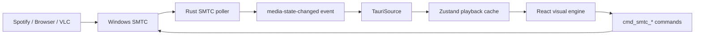

# VinylDeck

VinylDeck is a Windows desktop app that turns whatever is playing on the system into a cinematic vinyl deck: live album art, animated record motion, themeable ambient lighting, mini mode, settings persistence, and real media controls through Windows SMTC.

V1 status: the current repo is the V1 development baseline plus the 2026-06-14 interaction polish pass. Backend Phase 10 hardening has passed automated verification and the user approved the real Spotify sync fix. The latest interaction polish is browser-inspected and automation-verified, but still awaits final manual approval in the live Tauri shell. Phase 11 Windows distribution/install validation is intentionally on hold for a later release pass.

## Quick Start

Requirements:

- Windows 10/11 with WebView2
- Node.js and npm
- Rust toolchain
- A media app that exposes Windows media sessions, such as Spotify, browser media, or VLC

```powershell
npm install
npm run tauri dev
```

For browser-only visual development:

```powershell
npm run dev
```

Browser mode uses the mock source. Tauri mode uses real SMTC unless forced:

```powershell
$env:VITE_FORCE_MOCK_SOURCE='true'
npm run tauri dev
```

## Features

- Real currently-playing media from Windows SMTC
- React visual engine with two active visual shells: Noir and Glass
- Album-art ambient color extraction with `fast-average-color`
- CSS vinyl renderer as the active path; dormant WebGL vinyl code remains hard-OFF
- Main, fullscreen, and mini window modes
- Backend-owned persisted settings shared across windows
- Focused-window keyboard shortcuts
- Keyboard Shortcuts and Quit To Tray settings toggles
- Tooltips, keycap hints, custom right-click context menu, directional track text, and in-place vinyl skip impulse
- Close-to-tray lifecycle and explicit quit
- Frontend and Rust regression coverage for playback adapters, settings, lifecycle, SMTC commands, and poller edge cases

## Commands

| Command | Purpose |
| --- | --- |
| `npm run dev` | Vite browser dev server with mock playback |
| `npm run build` | TypeScript check and frontend production build |
| `npm run test:frontend` | Vitest frontend tests |
| `npm run tauri dev` | Tauri desktop dev app with real SMTC |
| `npm run check:rust` | Rust compile check |
| `npm run fmt:rust` | Rust formatting check |
| `npm run clippy:rust` | Rust lint gate with warnings denied |
| `npm run test:rust` | Rust test suite |
| `npm run tauri build -- --debug` | Debug desktop bundle build |

## Architecture



The Visual Engine only consumes the `PlaybackState`/`PlaybackSource` contract. Browser mode supplies `MockSource`; Tauri mode supplies `TauriSource`, which bridges Rust SMTC commands/events into the same interface.

## Documentation

- [Architecture](./docs/ARCHITECTURE.md)
- [Tauri API Reference](./docs/API.md)
- [Development Guide](./docs/DEVELOPMENT.md)
- [User Guide](./docs/USER_GUIDE.md)
- [Troubleshooting](./docs/TROUBLESHOOTING.md)
- [V1 Release Notes](./docs/RELEASE_V1.md)
- [Changelog](./CHANGELOG.md)

## V1 Notes

- Version remains `0.1.0` across `package.json`, `src-tauri/tauri.conf.json`, and `src-tauri/Cargo.toml`.
- Phase 11 distribution validation is deferred. Debug MSI/NSIS bundles were produced during Phase 10, but clean release installer testing is not part of this V1 baseline.
- In-app playback controls use real SMTC. Tray window actions are available; tray playback menu unification with the SMTC command path should be revalidated before distribution.
- A non-blocking Tauri warning currently notes that bundle identifier `com.vinyldeck.app` ends with `.app`; handle this during the deferred distribution pass.
- Not-current/cancelled items: shortcut editing UI, start-with-Windows/autostart, splash screen, active WebGL vinyl renderer, and vinyl left/right slide transitions.

## Recommended IDE Setup

- [VS Code](https://code.visualstudio.com/) + [Tauri](https://marketplace.visualstudio.com/items?itemName=tauri-apps.tauri-vscode) + [rust-analyzer](https://marketplace.visualstudio.com/items?itemName=rust-lang.rust-analyzer)
