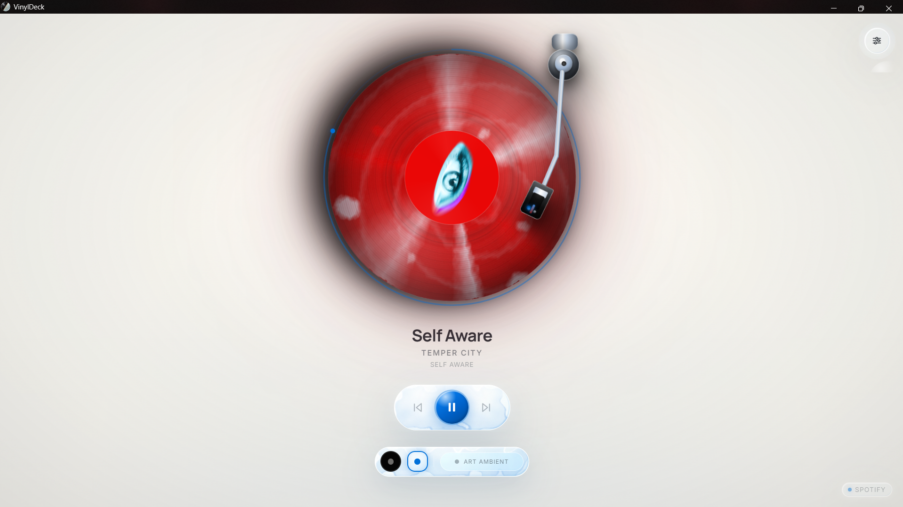
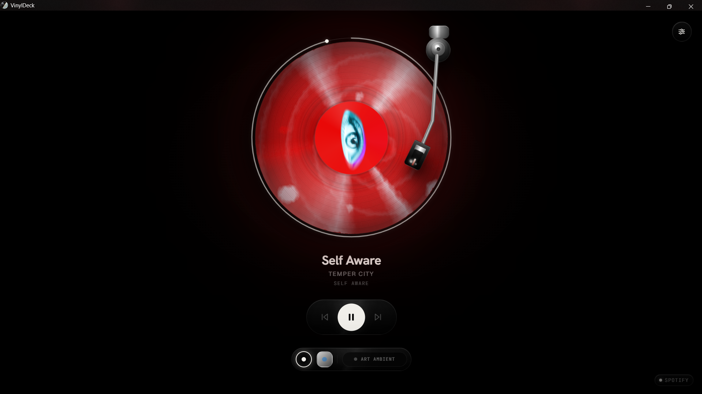
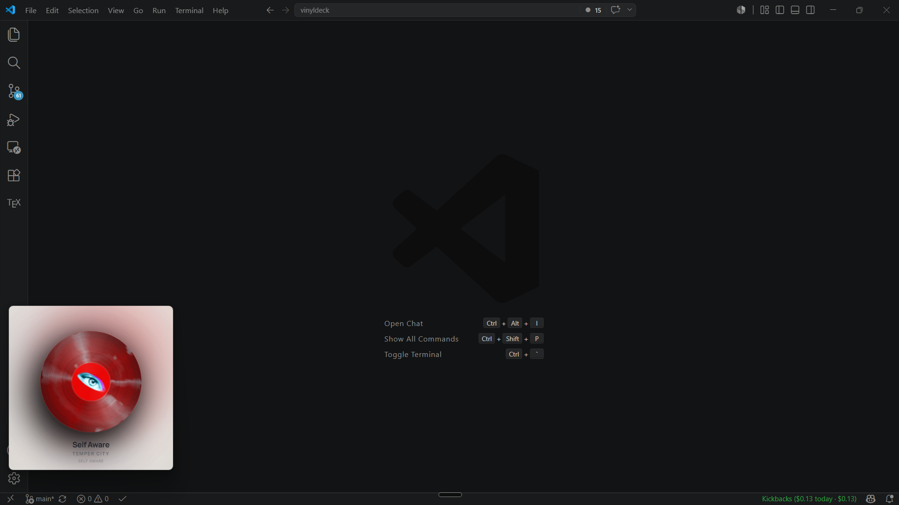
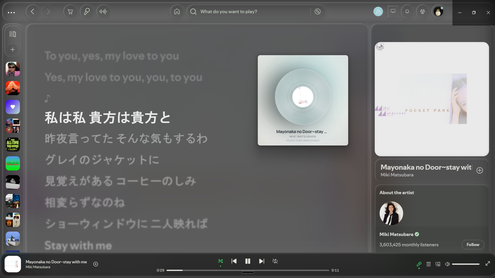
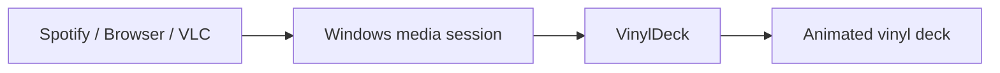

<h1 align="center">
  <br>
  VinylDeck
</h1>

<p align="center">
  <strong>A cinematic vinyl experience for everything playing on your Windows desktop.</strong>
</p>

<p align="center">
  <a href="./docs/USER_GUIDE.md">User Guide</a>
  ·
  <a href="./docs/ARCHITECTURE.md">Architecture</a>
  ·
  <a href="./docs/DEVELOPMENT.md">Development</a>
  ·
  <a href="./CHANGELOG.md">Changelog</a>
</p>

<p align="center">
  
  
  
  
</p>

VinylDeck turns the track already playing on your system into a living turntable. Album art becomes the record label, extracted colors bloom through the scene, the needle breathes with the music state, and every control feels like part of a physical deck.

Built with Tauri, Rust, React, and Windows media integration, VinylDeck is designed to feel native, lightweight, and quietly dramatic.

## Highlights

- **Works with system media** - reads Windows media sessions from apps such as Spotify, browsers, and VLC.
- **Cinematic vinyl rendering** - animated record motion, album-art label, physical tonearm, ambient bloom, film grain, and glass/noir shells.
- **Native desktop feel** - main, fullscreen, and compact mini-player modes with tray lifecycle.
- **Opt-in startup** - launch with Windows when you want VinylDeck ready as a quiet companion.
- **Real media controls** - play, pause, previous, next, and seek flow through Windows SMTC when supported by the active source.
- **Persistent settings** - visual and behavior preferences sync across app windows through the Rust backend.
- **Keyboard-first polish** - focused shortcuts, keycap hints, custom tooltips, and a right-click command menu.

## Preview

VinylDeck is a desktop-first visual player, not a streaming service. Start music in your usual app, open VinylDeck, and the active system session becomes the deck.

<p align="center">
  
</p>
<p align="center">
  
</p>
<p align="center">
  
  
</p>



## Quick Start

Requirements:

- Windows 10 or 11
- Microsoft WebView2 runtime
- Node.js + npm
- Rust toolchain

Run the desktop app:

```powershell
npm install
npm run tauri dev
```

Run browser-only visual development with mock playback:

```powershell
npm run dev
```

## Controls

| Action | Shortcut |
| --- | --- |
| Play / pause | `Space` |
| Previous / next | `Left` / `Right` |
| Fullscreen | `F` |
| Mini player | `M` |
| Cycle shell | `T` |
| Settings | `S` |
| Art Ambient | `A` |
| Quit | `Ctrl+Q` |

Shortcuts can be turned off in Settings. Escape remains available for closing Settings or leaving fullscreen.

## Documentation

- [User Guide](./docs/USER_GUIDE.md) - controls, window modes, settings, and daily use.
- [Development Guide](./docs/DEVELOPMENT.md) - setup, commands, verification, and contribution workflow.
- [Architecture](./docs/ARCHITECTURE.md) - React visual engine, Rust backend, SMTC flow, and state ownership.
- [Tauri API Reference](./docs/API.md) - command and event contracts between frontend and backend.
- [Troubleshooting](./docs/TROUBLESHOOTING.md) - common runtime and media-session issues.
- [Release Notes](./docs/RELEASE_V1.md) - version notes and distribution checklist.
- [Changelog](./CHANGELOG.md) - notable project changes.

## Development Commands

| Command | Purpose |
| --- | --- |
| `npm run dev` | Start Vite with mock playback |
| `npm run build` | Type-check and build frontend |
| `npm run test:frontend` | Run Vitest frontend tests |
| `npm run tauri dev` | Start desktop app with Tauri |
| `npm run check:rust` | Check Rust backend |
| `npm run fmt:rust` | Check Rust formatting |
| `npm run clippy:rust` | Run Rust lint gate |
| `npm run test:rust` | Run Rust tests |

## Tech Stack

- Tauri v2 desktop shell
- Rust backend for Windows media, settings, tray, and window lifecycle
- React 19 + TypeScript visual engine
- Zustand v5 state cache
- `motion/react` v12 animation
- `fast-average-color` album-art color extraction
- Pure CSS theme system with custom properties

## Project Status

VinylDeck is actively developed for Windows. The current version is `0.1.0`. Ready-to-use installers are available on the GitHub Releases page.

## License

No license file is currently published.
