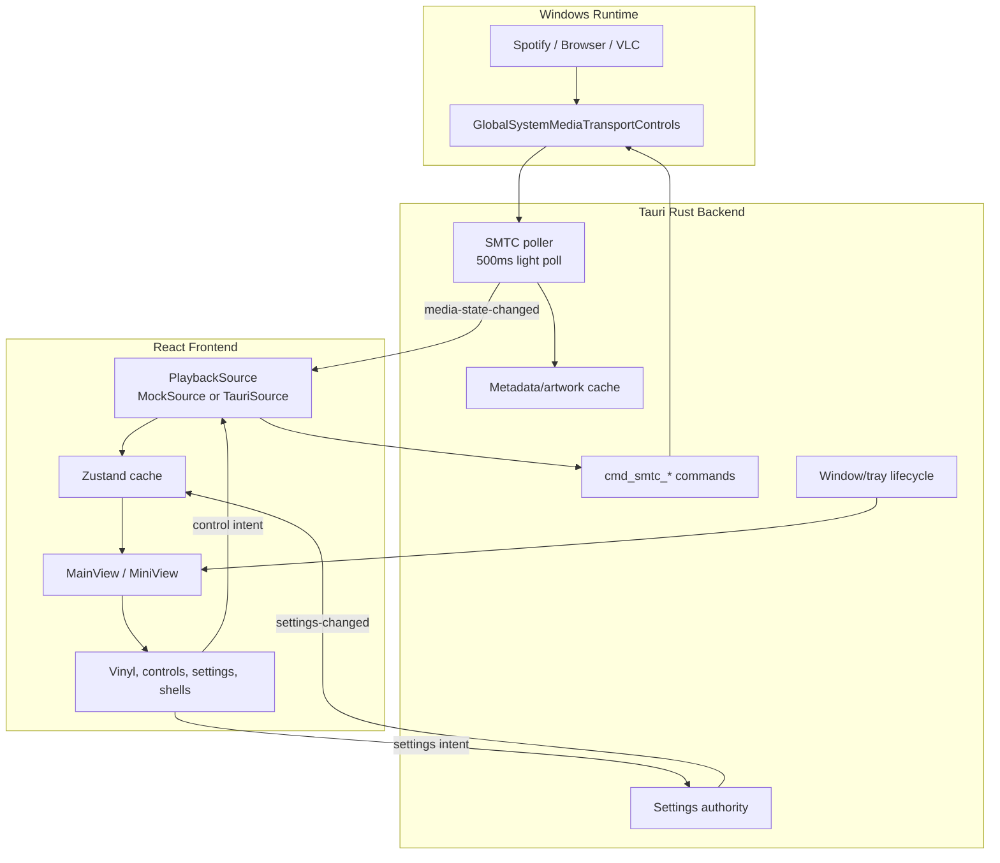
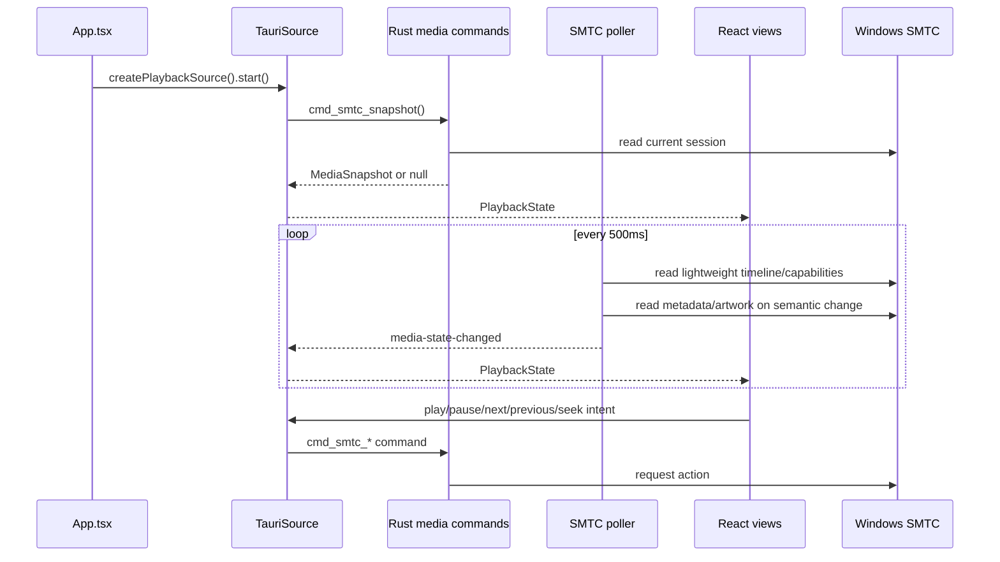
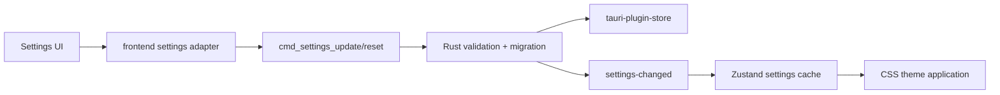
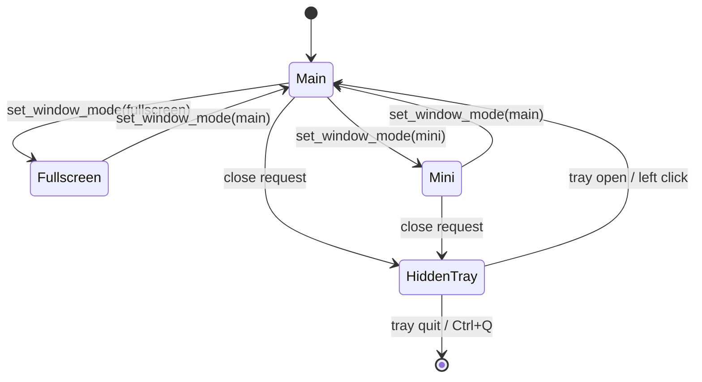

# VinylDeck Architecture

VinylDeck is split into a platform-neutral React visual engine and a Windows-specific Tauri backend. The central rule is simple: React renders; Rust owns native integration, durable settings, and real system media access.

## System Overview

## Playback Flow

The poller emits semantic changes immediately and position resyncs periodically. Artwork is cached by source, track, artist, album, and duration so it is not decoded every poll.

## State Ownership

| State | Authority | Frontend role |
| --- | --- | --- |
| Playback in browser dev | `MockSource` | Visual development only |
| Playback in Tauri | Windows SMTC through Rust | Render cache and command intent |
| Persisted settings | Rust settings authority | Optimistic UI plus backend-approved snapshots |
| Runtime QA flags | Zustand | Local only |
| Window mode and lifecycle | Rust window/tray modules | Request mode changes |
| Theme application | CSS custom properties | Apply backend-approved setting |

## Current Visual Surface

The current app exposes two active shells: Noir and Glass. Older Aurora, Vapor, and Paper values remain migration inputs only. Album art still drives the vinyl pressing material and optional Art Ambient glow.

The active vinyl renderer is the CSS/DOM renderer. WebGL vinyl code remains in the repo as a dormant experiment with its feature flag hardcoded off. The center spindle hole is intentionally absent so album artwork remains unobscured.

## Settings Flow

Rust clamps and normalizes settings before persistence. Frontend validation is defensive only; WebViews are views/controllers, not durable storage authorities.

## Window And Lifecycle Model

Main and fullscreen reuse the `main` window. Mini is a separate always-on-top window. Close requests hide to tray; explicit quit destroys windows and exits.

## Implementation Boundaries

- Real in-app playback uses SMTC through `cmd_smtc_*`.
- Browser mode remains mock-only by design.
- Shortcut editing UI, autostart/start-with-Windows, and splash screen are not implemented.
- Public installer validation is tracked separately from architecture work.
- Tray playback menu code still uses the older backend media command path and should be unified with SMTC before distribution-grade release validation.
