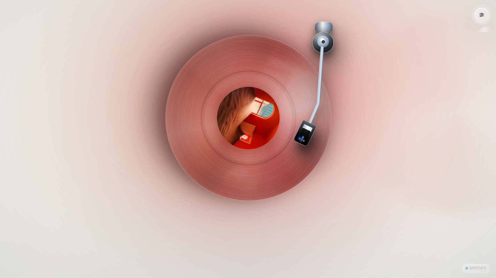
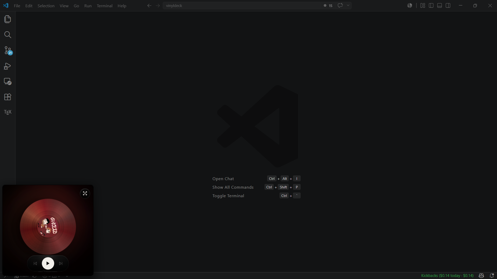
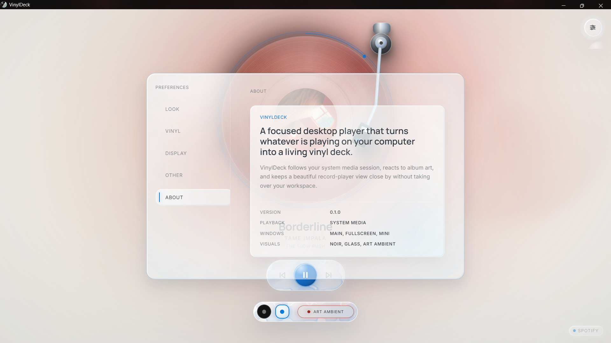

# User Guide

This guide covers using VinylDeck as a desktop companion for music already playing on Windows.

## Starting The App

Run VinylDeck in desktop mode:

```powershell
npm run tauri dev
```

Start playback in a Windows media app such as Spotify, a browser, or VLC. VinylDeck listens to the active system media session and renders the current track as a vinyl deck.

Browser development mode is available with mock playback:

```powershell
npm run dev
```

## Main Player

The main view combines:

- animated vinyl record with album art
- physical tonearm
- track title, artist, and album
- progress ring and seek support when the source allows it
- play/pause, previous, and next controls
- shell picker
- source badge

Controls automatically disable when the active media source does not support that action.

## Window Modes

| Mode | What it does |
| --- | --- |
| Main | Standard VinylDeck desktop window |
| Fullscreen | Immersive full-window player |
| Mini | Resizable always-on-top player |

<p align="center">
  
  
</p>

Mini starts as a `280x280` always-on-top player. You can shrink it down to a compact size, but it will not expand beyond the original square. As Mini gets smaller, the vinyl and hover controls scale down with the window and track text fades away to keep the record clear. Turn on Mini Transparency in Settings -> Display to let Windows Acrylic blur your desktop through the Mini player while the vinyl and controls stay readable.

Closing app windows can keep VinylDeck in the tray when Quit To Tray is enabled. Use tray Quit or `Ctrl+Q` for explicit exit.

## Keyboard Shortcuts

Shortcuts work while a VinylDeck window is focused.

| Action | Shortcut |
| --- | --- |
| Play / pause | `Space` |
| Previous | `Left` |
| Next | `Right` |
| Fullscreen | `F` |
| Mini player | `M` |
| Cycle shell | `T` |
| Settings | `S` |
| Toggle Art Ambient | `A` |
| Close settings / leave fullscreen | `Escape` |
| Quit | `Ctrl+Q` |

Disable shortcuts in Settings -> Other. Escape remains available for closing Settings and leaving fullscreen.

Start With Windows is opt-in. When enabled, VinylDeck launches automatically after sign-in so it can sit ready while you start music normally.

## Settings

Settings persist across app windows.

<p align="center">
  
</p>

| Section | Options |
| --- | --- |
| Look | Noir and Glass visual shells |
| Vinyl | Vinyl wobble, film grain, album-art ambient lighting |
| Display | Main/fullscreen/mini, always-on-top, lean-back, cursor behavior, idle timeout, Mini Transparency |
| Other | Keyboard Shortcuts, Quit To Tray, Start With Windows |
| About | App identity and build information |

## Context Menu

Right-click the player to open the VinylDeck command menu. It includes playback actions, Art Ambient, fullscreen, mini player, Settings, and Quit. Mini mode keeps only actions that make sense for the compact window.

## Visual Behavior

- Noir and Glass are the current visual shells.
- Art Ambient uses album colors to tint the atmosphere.
- Track changes triggered inside VinylDeck animate directionally.
- The record stays visually anchored and receives an in-place skip impulse.

## Troubleshooting

See [Troubleshooting](./TROUBLESHOOTING.md) for media-session detection, disabled controls, WebView2, tray, and shortcut issues.
